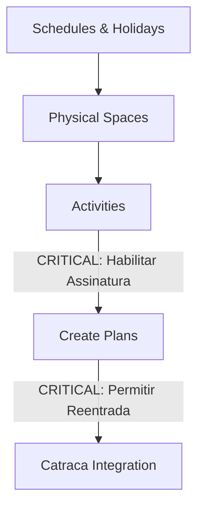

# Manual Definitivo de Implantação e Operação — Sistema Actuar

> Guia master corporativo para a administração da Academia e do Estúdio de Pilates. Este documento reúne as diretrizes da apresentação interna do sistema, dados técnicos obtidos de fóruns especializados, boas práticas de grupos de gestores e tutoriais oficiais da plataforma. Espelhado automaticamente para o **Obsidian** via junction.

---

# 🌟 1. Introdução ao Ecossistema Actuar

O **Actuar** é uma das soluções de gestão e controle de acesso mais respeitadas no mercado fitness brasileiro. A sua principal proposta de valor é ser uma solução **"All-in-One"**: em vez de contratar um software de um fornecedor e uma catraca de outro, a Actuar projeta e fornece o software (SaaS) e o hardware (catracas TCP/IP, leitores biométricos e reconhecimento facial) de forma integrada. 

Isso resulta em um suporte técnico unificado e na eliminação de conflitos de comunicação entre sistemas de terceiros.

---

# 🌐 2. Infraestrutura, Rede e Conectividade da Catraca

A comunicação estável entre o servidor na nuvem da Actuar e a catraca física instalada na recepção é o coração da automação do seu espaço.

### 🔌 Cenário Físico e Instalação de Rede
* **Comunicação IP Nativa:** As catracas Actuar utilizam protocolo TCP/IP padrão. Elas devem ser conectadas diretamente ao roteador ou switch da academia por meio de cabo de rede RJ45 (padrão Cat5e ou Cat6).
* **Operação Offline (Contingência):** Se a internet da academia cair, a catraca não para de funcionar imediatamente. Ela possui memória interna (firmware) capaz de armazenar as últimas regras de acesso e biometrias sincronizadas. Os alunos ativos continuarão entrando. No entanto, novos cadastros e pagamentos feitos durante a queda só serão validados quando a rede voltar.
* **Liberação Manual na Recepção:** Em caso de travamento físico ou queda total da rede de comunicação, a recepção pode liberar o braço da catraca manualmente por meio do botão físico de emergência instalado sob o balcão ou via comando de liberação na tela do sistema (caso haja conexão local).

---

# ⚙️ 3. Configuração Inicial do Espaço (Passo a Passo)

Acesse o menu principal clicando em **Configurações (ícone de engrenagem) > Geral**. A estruturação correta aqui garante que as regras de negócio funcionem perfeitamente.

### ⏰ 3.1. Horários de Funcionamento, Pausas e Feriados
1. **Configuração da Grade Semanal:**
   * Defina os horários de funcionamento padrão de segunda a sexta (ex: `06:00` às `22:00`).
   * Adicione horários para sábados e domingos conforme a rotina do espaço.
2. **Pausa para Almoço/Intervalos (Duplo Turno):**
   * Se o seu estúdio de Pilates ou academia fecha durante o almoço ou horários de menor movimento, clique em **"Adicionar segundo horário"**.
   * *Turno 1:* Horário de abertura até o início da pausa (ex: `07:00` às `12:00`).
   * *Turno 2:* Horário de retorno até o fechamento (ex: `14:00` às `20:00`).
3. **Feriados e Recessos Customizados:**
   * O sistema já vem com uma lista de feriados nacionais. Clique na engrenagem ao lado do feriado para alternar entre **Aberto** (com horário padrão de feriado, ex: `07:00` às `14:00`) ou **Fechado**.
   * Para recessos específicos da sua cidade ou eventos internos, clique em **"Novo evento"**, digite o nome (ex: *Feriado Municipal* ou *Manutenção Interna*), selecione a data e marque a regra de acesso.

### 🏢 3.2. Cadastro de Espaços (Salas)
Cadastre as áreas físicas do seu estabelecimento para que o sistema possa gerenciar lotações e horários de agendamento:
* **Áreas Comuns:** *Sala de Musculação*, *Estúdio de Pilates*, *Sala de Dança*, *Piscina*.
* Defina o nome e a capacidade máxima de alunos se desejar controlar a lotação por horário.

### 🏃 3.3. Atividades
Aqui você cadastra as modalidades práticas do seu negócio (ex: *Musculação*, *Pilates*, *FitDance*).
1. Clique em **"Nova Atividade"**.
2. Digite o nome da atividade e clique em **"Buscar ícone"** para definir uma identificação visual amigável.
3. > [!IMPORTANT]
   > **A Regra de Ouro das Atividades (Habilitar para Assinatura):**
   > Na aba **Avançado** da atividade, você **DEVE** marcar a caixa **"Habilitar para assinatura"** e salvar. Se essa opção for esquecida, a atividade ficará invisível na tela de criação de planos, impedindo que você venda pacotes associados a ela.

---

# 💳 4. Arquitetura de Planos e Cobrança Recorrente

Acesse **Configurações > Planos**. É aqui que o seu modelo de vendas é estruturado financeiramente.

### 🔄 4.1. Configurando Ciclos e Recorrência (Sem consumir o limite do cartão)
A Actuar permite a venda de planos de longo prazo usando o sistema de cobrança recorrente no cartão de crédito do aluno.

| Tipo de Plano | Duração | Quantidade de Parcelas | Como é cobrado do Aluno |
|---|---|---|---|
| **Mensal Padrão** | 1 Mês | 1 | Cobrança única de 30 dias. |
| **Trimestral** | 3 Meses | 3 | Cobrança mensal recorrente por 3 meses. |
| **Anual Recorrente** | 12 Meses | 12 | O sistema cobra mensalmente no cartão do aluno. Consome apenas o valor da parcela mensal do limite do cartão dele, garantindo menor inadimplência. |

* **Como cadastrar a Recorrência:** Ao cadastrar o ciclo do plano (ex: Anual), informe o período de `12 meses`, a quantidade de parcelas como `12` e insira o valor da mensalidade (ex: `R$ 180,00`). Na hora de matricular o aluno, a recepção cadastra o cartão de crédito uma única vez; o sistema gera os lançamentos e realiza o débito automático mensalmente de forma transparente.

### 🚨 4.2. A Regra de Ouro dos Planos: Permitir Reentrada
> [!WARNING]
> Ao configurar qualquer plano voltado para a **Academia/Musculação**, vá até a aba **Avançado** e ative a opção **"Permitir reentrada"**.
> 
> * **Se desativado:** O aluno só pode passar pela catraca **uma única vez no dia**. Se ele sair para buscar uma garrafa de água no carro ou quiser retornar para um treino de cardio à noite, a catraca bloqueará o seu acesso exibindo a mensagem "Acesso Já Realizado".
> * **Se ativado:** A catraca permite múltiplas entradas e saídas do aluno ao longo do dia, registrando cada passagem no histórico de acesso para controle de fluxo.

### 📊 4.3. Regras Financeiras Customizadas (Promoções e Reajustes)
Se você deseja criar promoções de atração (ex: *"Matricule-se por R$ 10 no primeiro mês e pague R$ 150 a partir do segundo"*):
1. Acesse **Conjunto de Regras Financeiras**.
2. Crie uma regra configurando o desconto inicial e definindo que o valor padrão será aplicado a partir do segundo mês.
3. Ao cadastrar o plano, vá na aba correspondente e ative a regra financeira criada. O sistema aplicará os valores automaticamente de forma cronológica na ficha financeira do aluno.

---

# 🎛️ 5. Dashboard, Recepção e Rotina Operacional

### 📱 5.1. Personalização do Dashboard (Kanban de Atalhos)
A tela inicial pode ser organizada em blocos (Decks) para facilitar a vida do recepcionista:
* Para adicionar um atalho: clique no sinal de **+ (Novo)** no canto superior do painel, escolha a função desejada (ex: *Novos Clientes*) e salve.
* Para reordenar os blocos: clique e arraste os blocos na tela para criar um fluxo visual dinâmico e amigável (semelhante a um painel Kanban).

### 📅 5.2. Agenda e Integração com o Aplicativo do Aluno
O Actuar possui integração nativa com o **Aplicativo de Treinos do Aluno** (geralmente chamado de *Treino* ou *Actuar Aluno*).
* **Pilates e Aulas Coletivas:** Os instrutores cadastram a grade de horários e a capacidade máxima de cada turma. Os alunos visualizam as vagas em tempo real em seus smartphones e reservam seu horário. A reserva aparece instantaneamente na agenda do sistema da recepção.
* **Presença:** A recepção pode dar baixa de presença manualmente na agenda ou configurar o sistema para dar presença automática assim que o aluno passar a biometria na catraca.

### 👥 5.3. Cadastro de Alunos e Biometria
* **Cadastro Rápido:** Na recepção, utilize o atalho de novos clientes para preencher os dados essenciais (Nome, CPF, Data de Nascimento, Telefone e E-mail).
* **Vínculo de Biometria/Facial:** Com o leitor USB conectado ao computador da recepção ou diretamente na catraca, selecione a opção "Cadastrar Biometria" na ficha do aluno. Solicite que ele posicione o dedo indicador 3 vezes para registro. Se o sistema utilizar reconhecimento facial, a foto pode ser capturada por uma webcam padrão na recepção e sincronizada com a catraca facial.

### 🔑 5.4. Cadastro de Usuários (Colaboradores)
Não compartilhe a senha master do administrador! Crie contas individuais para cada funcionário para rastrear ações financeiras e operacionais:
1. Vá em **Configurações > Usuários**.
2. Cadastre o colaborador e defina o seu nível de acesso (ex: *Recepção*, *Professor*, *Gerente*).
3. Cada ação realizada no caixa ou alteração de contrato ficará registrada com o login e timestamp do operador correspondente.

---

# 📦 6. Módulos de Serviços e Mercadorias

Tudo o que não se enquadra como plano recorrente (mensalidade) é gerenciado por estes módulos.

### 💆 6.1. Serviços (Diárias, Avaliações Físicas e Personal)
* **Como funciona:** Itens avulsos que a academia comercializa mas que não dão direito a livre acesso mensal.
* **Cadastro:** Acesse **Serviços > Novo Serviço**. Dê um nome, escolha um ícone e, na aba **Avançado**, marque **"Habilitar para assinatura"** para que o item apareça como opção de lançamento rápido na ficha do aluno.

### 🧦 6.2. Mercadorias (Venda Física de Produtos)
* **Como funciona:** Venda de produtos físicos na recepção (meias de pilates, garrafas de água, suplementos).
* **Estoque:** Acesse **Mercadorias > Controle de Estoque** para cadastrar os produtos, preço de custo, preço de venda e configurar alertas de estoque mínimo para reposição automática.

---

# 👤 7. Central de Suporte e Faturamento do Licenciamento

Para gerenciar o seu contrato com a Actuar e solicitar suporte técnico:

### 🆔 7.1. ID de Atendimento (O dado mais importante da sua conta!)
* **O que é:** Um código identificador numérico exclusivo do seu espaço, localizado de forma visível dentro do seu **Perfil Administrativo Master** no topo do sistema.
* **Importância:** Qualquer colaborador (mesmo logado com conta de recepção) que entrar em contato com o suporte técnico da Actuar (seja pelo chat do sistema, robô de autoatendimento ou WhatsApp oficial) **deverá fornecer o ID de Atendimento** master. Sem esse número, o suporte não consegue abrir chamados técnicos ou acessar a sua base de dados. Mantenha esse ID anotado e visível para a equipe da recepção!

### 💳 7.2. Gerenciar Faturamento
* Localizado em **Perfil > Gerenciar Faturamento**.
* Exibe as faturas da mensalidade do próprio sistema Actuar.
* Permite efetuar o pagamento diretamente na plataforma clicando nos **3 pontinhos** ao lado da fatura pendente. Evite suspensões do sistema mantendo o faturamento em dia por esta aba.

---

# 🛠️ 8. Guia de Resolução de Problemas (Troubleshooting Especializado)

Com base em discussões de grupos de WhatsApp de gestores de academia, fóruns técnicos e suporte oficial, aqui estão as soluções para os problemas mais comuns no dia a dia com a Actuar:

### ❌ Problema 1: "O aluno passou a biometria/rosto e a catraca deu 'Acesso Negado', mas o plano dele está ativo e em dia."
* **Causa A (Regra da Atividade):** A atividade associada ao plano do aluno (ex: Musculação) não está com a opção **"Habilitar para assinatura"** marcada nas configurações gerais de Atividades. A catraca não reconhece que o plano dá direito de acesso físico àquela modalidade.
  * *Solução:* Vá em *Configurações > Atividades*, edite a atividade correspondente, acesse a aba *Avançado*, marque *Habilitar para assinatura* e salve.
* **Causa B (Sincronização pendente):** O aluno acabou de pagar ou renovar o plano e a catraca física ainda não recebeu a atualização do servidor da nuvem.
  * *Solução:* Na recepção, acesse a ficha do aluno e clique em **"Forçar Sincronização"** ou aguarde de 2 a 3 minutos para a comunicação automática da rede local.

### ❌ Problema 2: "O aluno quer fazer um treino extra ou reentrar na academia e a catraca bloqueia com mensagem 'Acesso Já Realizado'."
* **Causa:** O plano associado ao aluno está com a opção **"Permitir reentrada"** desativada nas configurações avançadas.
  * *Solução:* Acesse *Configurações > Planos*, edite o plano em questão, vá na aba *Avançado*, habilite a opção *Permitir reentrada* e salve. **Importante:** Alteraçōes em planos existentes só se aplicam automaticamente para novos contratos. Para alunos antigos, você deve atualizar a regra manualmente em suas assinaturas vigentes ou aguardar a renovação.

### ❌ Problema 3: "A mensalidade do aluno venceu e ele está inadimplente, mas a catraca continua liberando a entrada normalmente."
* **Causa A (Configuração de Tolerância):** O sistema possui um prazo de tolerância para inadimplência configurado nas regras gerais de cobrança (ex: liberar acesso por até 5 dias após o vencimento).
  * *Solução:* Acesse as configurações financeiras gerais e reduza o prazo de tolerância de inadimplência para `0 dias` se deseja o bloqueio imediato no dia seguinte ao vencimento.
* **Causa B (Catraca em modo offline):** A catraca perdeu a conexão com o servidor na nuvem e está operando de forma autônoma com a última lista de permissões gravada em cache antes do vencimento do aluno.
  * *Solução:* Verifique a conexão de internet da recepção e reinicie a catraca retirando-a da tomada por 10 segundos para forçar o restabelecimento da comunicação TCP/IP.

### ❌ Problema 4: "Catraca apresenta lentidão ou falha constante no reconhecimento biométrico (dedo do aluno)."
* **Causa A (Sujeira no Prisma):** O prisma de vidro do leitor biométrico acumula gordura dos dedos e poeira ao longo do dia, dificultando a leitura óptica.
  * *Solução:* Limpe o leitor diariamente utilizando apenas uma fita adesiva transparente (cole e retire para remover a sujeira) ou um pano macio levemente umedecido em água. Nunca use álcool ou produtos abrasivos, pois eles removem a camada protetora do silicone do leitor.
* **Causa B (Pele Seca/Fria):** Dedos muito secos ou frios (comum nas manhãs de inverno) reduzem a condutividade e o contraste das digitais.
  * *Solução:* Peça para o aluno friccionar o dedo na calça ou soprar ar quente da boca no dedo antes de posicioná-lo no leitor.

### ❌ Problema 5: "Mensalidade do aluno na Recorrência falhou no cartão de crédito."
* **Causa A (Falta de Limite/Saldo):** Embora a recorrência não bloqueie o valor anual total, o cartão do aluno precisa ter saldo disponível igual ou superior ao valor da parcela mensal no dia do débito.
  * *Solução:* O sistema Actuar tentará reprocessar o débito automaticamente em ciclos definidos (ex: a cada 3 dias). Caso persista o erro, a recepção deve entrar em contato com o aluno para que ele atualize os dados do cartão na área do aluno ou realize o pagamento da parcela em dinheiro/PIX na recepção para liberar o acesso físico.
