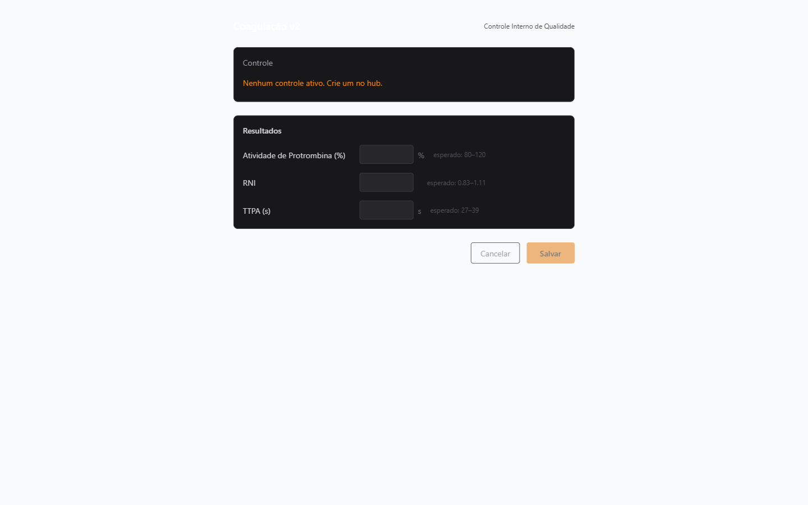
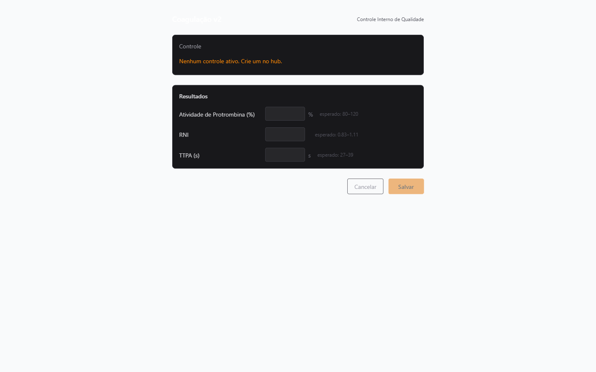
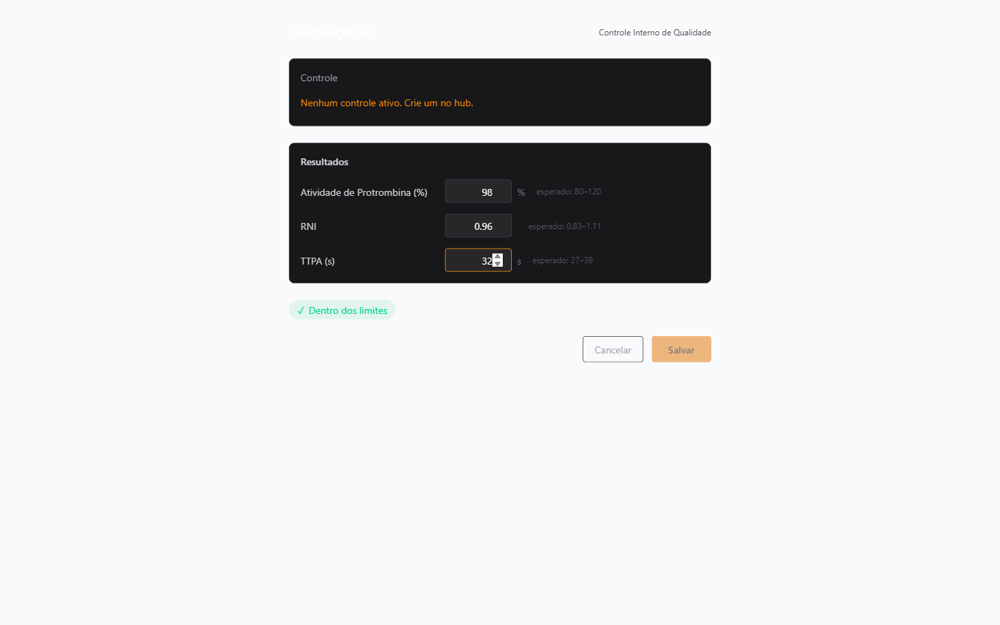

# Manual — Coagulação v2 (Coagulômetro)

> Guia prático para o laboratório: como fazer o controle interno de qualidade de coagulação no sistema HC Quality. Escrito para técnicos e responsáveis técnicos. Versão 2 do módulo (Clotimer / coagulômetros).

**Última atualização:** maio/2026

---

## Antes de tudo: o que é cada coisa

Mesmo que você já conheça hematologia, vale revisar esses conceitos — eles se aplicam à coagulação com algumas particularidades:

| Palavra | O que significa, sem firula |
|---|---|
| **Controle de coagulação** | Plasma controle com valores conhecidos de AP, RNI e TTPA. Passa no coagulômetro pra ver se a máquina tá medindo certo. |
| **Nível I (normal)** | Controle com valores dentro da faixa fisiológica — pra validar que a máquina mede "amostra normal" direito. |
| **Nível II (alterado)** | Controle com valores fora da faixa — pra validar que a máquina mede "amostra de paciente anticoagulado" direito. |
| **AP (Atividade de Protrombina)** | % de atividade da protrombina. Faixa típica: 80–120% no Nível I. Valores abaixo de 70% indicam anticoagulação. |
| **RNI (Razão Normalizada Internacional)** | Número adimensional padronizado mundialmente. Paciente estável em varfarina: RNI 2,0–3,0. Controle Nível I: ~0,97. |
| **TTPA (Tempo de Tromboplastina Parcial Ativada)** | Segundos. Faixa típica: 27–39seg. |
| **Lote controle** | Número do lote do plasma controle. Cada lote tem uma bula com valores de referência. |
| **Corrida / tentativa (attempt)** | Uma rodada de teste do controle no coagulômetro. Cada tentativa vira um ponto no gráfico Levey-Jennings. |
| **Westgard** | Regras que olham os pontos do gráfico e dizem se a corrida está OK ou se tem desvio sistemático. |

**Cores da tela:**

- 🟢 **Verde** = aprovado em todas as regras. Libera resultado do paciente.
- 🟡 **Amarelo** = warning (ex.: 1-2s). Segue, mas anota.
- 🔴 **Vermelho** = rejeitado (ex.: 1-3s, 2-2s). **Não libera nada. Investigar antes.**

---

## Cenário 1 — Rotina diária: passar o controle

### O que fazer (5 minutos)

1. **Prepare o coagulômetro** (liga, deixa aquecer, segue o procedimento do equipamento).
2. **Pegue o frasco de plasma controle** em uso. Misture devagar por inversão (não chacoalhe — plasma controle espuma).
3. **Passe o controle no coagulômetro**. O equipamento cospe os 3 valores: AP%, RNI e TTPA.
4. **Abra o sistema HC Quality** → faça login.
5. Na tela inicial (**ModuleHub**), clique em **Coagulação v2**.

   

6. O formulário abrirá com o **primeiro controle ativo pré-selecionado** automaticamente.

   

7. **Preencha os 3 resultados**: Atividade de Protrombina (em %), RNI e TTPA (em segundos).

   

8. **Observe o ConformityBadge** abaixo dos resultados — ele aparece automaticamente:
   - 🟢 **Conforme** = todos os valores dentro da faixa. Pode salvar.
   - 🔴 **Não conforme** = pelo menos um valor fora da faixa. O formulário vai pedir uma **ação corretiva**.

   

9. Clique em **Salvar**. O sistema grava a tentativa, aplica as regras Westgard, e mostra a tela de sucesso.

   

### O que olhar para saber se está tudo certo

Depois de salvar, duas coisas importantes aparecem:

#### 1. O resultado da tentativa (badge superior)

- 🟢 Verde = passou. Libera laudos do dia.
- 🔴 Vermelho = reprovou alguma regra Westgard. Vá para a seção **"Quando reprova"**.

#### 2. O gráfico Levey-Jennings (abaixo do formulário)

Cada analito (AP, RNI, TTPA) tem um gráfico próprio. O sistema agrupa por nível (I e II). Olhe:

- **Pontinho dentro da faixa central** (entre -2σ e +2σ) = ✅
- **Pontinho entre ±2σ e ±3σ** (faixa amarela) = ⚠️ warning 1-2s
- **Pontinho além de ±3σ** (fora) = 🚨 violação 1-3s, reprovação automática
- **2 ou mais pontos consecutivos do mesmo lado de ±2σ** = 🚨 violação 2-2s


---

## Cenário 2 — Quando a corrida não é conforme (vermelho)

Não entre em pânico. O sistema é feito exatamente pra capturar isso.

### ❌ NÃO faça:

- ❌ Não repita a corrida "pra ver se desta vez dá certo" sem investigar antes.
- ❌ Não libere laudo de paciente baseado numa corrida reprovada.
- ❌ Não apague a tentativa — é impossível (prova de auditoria, RDC 978).

### ✅ Faça:

1. **Anota mentalmente** qual analito reprovou (AP, RNI ou TTPA) e qual violação.
2. O formulário vai mostrar automaticamente o campo **Ação corretiva**:

   

3. **Escreva o que foi feito**. Exemplos válidos de ação corretiva:
   - "Repetida a corrida com novo frasco de controle do mesmo lote; resultado dentro da faixa."
   - "Verificado reagente fora da validade; substituído e corrida repetida com sucesso."
   - "Equipamento recalibrado conforme POP-017; nova corrida aprovada."
   - "Lote novo do controle posto em uso; aguardando validação de 20 dias."

4. **Clique em Salvar.** A tentativa reprovada fica registrada junto com a ação corretiva, criando evidência para auditoria (RDC 978 Art. 128).

### Investigação das causas mais comuns

Antes de repetir, verifique:

| Causa provável | Como confirmar |
|---|---|
| **Plasma controle estragado / fora de validade** | Validade do frasco; aspecto visual (turvo, precipitado) |
| **Mistura inadequada** | Confirma se fez 8-10 inversões suaves (não chacoalhou) |
| **Temperatura errada** | Controle deve estar entre 2-8°C na geladeira (não congelador) |
| **Reagente vencido** | Verificar lote e validade do reagente de tromboplastina |
| **Equipamento sem calibração** | Data da última calibração do coagulômetro |
| **ISI da tromboplastina mudou** | Se trocou de lote do reagente, o ISI novo precisa estar cadastrado |

Se a causa não for óbvia, **chame o Responsável Técnico (RT)**.

---

## Cenário 3 — Responsável Técnico: aprovar, rejeitar, NOTIVISA

Apenas o RT (ou super-admin) consegue acessar algumas funções específicas. Elas ficam no **Painel RT** do módulo Coagulação.

### O que o RT precisa fazer periodicamente

1. **Acessar o Painel RT** via o menu lateral do módulo Coagulação.
2. **Ver a lista de tentativas pendentes** de análise crítica.
3. Para cada tentativa ou grupo de tentativas, uma das 3 ações:

| Ação | Quando usar | O que faz no sistema |
|---|---|---|
| ✅ **Aprovar** | Tentativas conformes, sem ação corretiva pendente | Marca como revisada e aprovada formalmente pelo RT (exigência RDC 978) |
| ❌ **Rejeitar** | Tentativa com problema sério que não foi corrigido | Bloqueia aquela tentativa e exige investigação + ação corretiva |
| 📋 **NOTIVISA** | Evento adverso relevante (reação adversa, lote defeituoso de fabricante) | Envia notificação à ANVISA via Notivisa (RDC 978 Art. 54) |

---

## Cenário 4 — Levey-Jennings: interpretar o gráfico

O gráfico Levey-Jennings é o coração do controle de qualidade de coagulação. Ele mostra os pontos históricos da corrida em cada analito, plotados contra as faixas de ±1σ, ±2σ e ±3σ do valor de referência do lote.

### Como ler rapidamente

- **Pontos todos no meio, oscilando**: máquina estável. ✅
- **Tendência** (pontos subindo ou descendo gradualmente): desvio sistemático. Chamar o RT. ⚠️
- **Todos os pontos do mesmo lado da média**: *shift* (desvio sistemático). Investigar. 🚨
- **Ponto isolado fora de ±3σ**: erro aleatório ou problema agudo. Investigar antes de liberar. 🚨

### Regras Westgard — o que cada uma significa

| Regra | Descrição | Gravidade |
|---|---|---|
| **1-2s** | 1 ponto fora de ±2σ | ⚠️ Warning (aprovado, mas acompanhar) |
| **1-3s** | 1 ponto fora de ±3σ | 🚨 **Rejeição automática** |
| **2-2s** | 2 pontos consecutivos fora de ±2σ do mesmo lado | 🚨 Rejeição (tendência) |
| **R-4s** | 2 pontos consecutivos com diferença > 4σ entre si | 🚨 Rejeição (variação) |
| **4-1s** | 4 pontos consecutivos fora de ±1σ do mesmo lado | 🚨 Rejeição (drift) |
| **10x** | 10 pontos consecutivos do mesmo lado da média | 🚨 Rejeição (shift) |

O sistema aplica essas regras **automaticamente**. Seu trabalho é ler o resultado e agir conforme a cor da badge.

---

## Cenário 5 — Trocar o lote do controle em uso

Chegou um novo lote de controle de coagulação. Você precisa:

1. **Cadastrar o novo lote** no módulo Controle Operacional (hub do módulo Coagulação).
2. **Atribuir o lote ao coagulômetro** (o sistema associa automaticamente ao equipamento do controle).
3. **Rodar 20 corridas** no novo lote em paralelo com o lote antigo (para validar e estabelecer o baseline do novo lote).
4. **RT aprova** o novo lote como "em uso oficial" após analisar as 20 corridas.

Enquanto o novo lote não é aprovado, o sistema mantém o lote antigo como ativo e o novo em modo "validação paralela".

---

## Cartão de pânico — quando parar e chamar o RT

Pare imediatamente e chame o RT quando:

- 🚨 **Violação 1-3s** (valor fora de ±3σ) — pode ser erro grosseiro ou reagente estragado.
- 🚨 **Várias violações Westgard seguidas** (3 ou mais) — problema sistemático.
- 🚨 **AP < 60%** sem explicação — possível amostra de paciente anticoagulado confundida com controle.
- 🚨 **RNI > 1,5 no Nível I** — reagente pode ter ISI errado ou equipamento precisa de recalibração.
- 🚨 **Tendência persistente** por 5+ dias — o RT precisa investigar.

**Nunca faça:**

- ❌ Apagar tentativas.
- ❌ Liberar laudo sem corrida verde do dia no controle do lote correto.
- ❌ Misturar lotes diferentes de controle (cada lote tem sua bula e seus valores esperados).
- ❌ Passar controle em temperatura ambiente (sempre entre 2-8°C).

---

## Resumo em 5 frases

1. **Todo dia**: passar plasma controle no coagulômetro, abrir HC Quality → Coagulação v2, preencher AP/RNI/TTPA, salvar, conferir se ficou verde.
2. **Se ficou verde**: liberar laudos de paciente do dia.
3. **Se ficou vermelho**: descrever ação corretiva e salvar; investigar causa (reagente, controle, equipamento); chamar o RT se não for óbvio.
4. **Trocou lote do controle**: cadastrar o novo no hub, rodar 20 corridas em paralelo, RT aprova.
5. **Levey-Jennings**: olhar tendências no gráfico semanalmente; pontos fora da banda ou todos do mesmo lado = investigar.

---

## Regeneração dos screenshots

Os screenshots deste manual são gerados automaticamente pelo script:

```bash
cd smoke-test
npx playwright test specs/coag-v2-manual-screenshots.spec.ts --headed
```

Output vai para `docs/manual/screenshots/coag/`. Para regenerar manualmente, execute o comando acima após garantir que:
1. O usuário RT (`drogafarto@gmail.com`) tem acesso a pelo menos um laboratório
2. O lab tem controles operacionais ativos e tentativas cadastradas
3. As variáveis `RT_EMAIL` e `RT_PASSWORD` estão configuradas em `smoke-test/.env.test`

---

## 🔗 Conexões Centrais

- [[HC_Quality]]
- [[Hematologia]]
- [[Coagulação_v2_ARQ]] — documentação de arquitetura técnica
